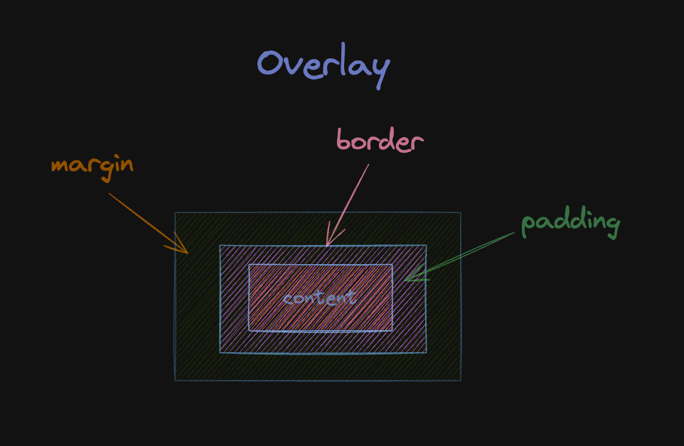

# React-dev-inspector 源码分析

::: tip
以下部分源码逻辑作了简化处理，主要关注整体的实现，忽略 Edge case
:::

## 使用方式

- 入口配置

```tsx
// index.js
import { Inspector } from 'react-dev-inspector'

const WrapComponent =
  process.env.NODE_ENV === 'development' ? Inspector : Fragment

  <WrapComponent keys={["control", "shift", "alt", "f"]}>
    <App />
  </WrapComponent>
```

- babel 配置

```js
// .babelrc.js
module.exports = {
  plugins: [
    'react-dev-inspector/plugins/babel',
    // more
  ],
}
```

- webpack 配置

```js
// webpack config
import type { Configuration } from 'webpack'
import { launchEditorMiddleware } from 'react-dev-inspector/plugins/webpack'

const config: Configuration = {
  devServer: {
    /**
     * react-dev-inspector - dev server config
     * for create-react-app@^5 + webpack-dev-server@^4.7
     */
    setupMiddlewares: (middlewares, devServer) => {
      middlewares.unshift(launchEditorMiddleware)
      return middlewares
    },

    /**
     * react-dev-inspector - dev server config
     * for create-react-app@^4 + webpack-dev-server@^3
     */
    before: (app, server, compiler) => {
      app.use(launchEditorMiddleware)

      // ... other middlewares after
    },
  },
}
```

## 编译时

`react-dev-inspector/plugins/babel `,拿到未编译的`tsx`源码，遍历 `AST`节点，给其中的`DOM`节点上添加源码位置信息: `line`、`column`、`relative path`

```ts
import {
  jsxAttribute,
  jsxIdentifier,
  stringLiteral,
} from '@babel/types/lib/builders/generated'
const doJSXOpeningElement: NodeHandler<
  JSXOpeningElement,
  { relativePath: string }
> = (node, option) => {
  const { stop } = doJSXPathName(node.name)
  if (stop) return { stop }

  const { relativePath } = option
  const line = node.loc?.start.line
  const column = node.loc?.start.column

  const lineAttr: JSXAttribute | null = isNil(line)
    ? null
    : jsxAttribute(
        jsxIdentifier('data-inspector-line'),
        stringLiteral(line.toString())
      )

  const columnAttr: JSXAttribute | null = isNil(column)
    ? null
    : jsxAttribute(
        jsxIdentifier('data-inspector-column'),
        stringLiteral(column.toString())
      )

  const relativePathAttr: JSXAttribute = jsxAttribute(
    jsxIdentifier('data-inspector-relative-path'),
    stringLiteral(relativePath)
  )

  const attributes = [lineAttr, columnAttr, relativePathAttr] as JSXAttribute[]

  // Make sure that there are exist together
  if (attributes.every(Boolean)) {
    node.attributes.unshift(...attributes)
  }

  return { result: node }
}
```

## 运行时

### Inspector 容器组件

#### 键盘事件监听

使用 [hotkeys-js](https://github.com/jaywcjlove/hotkeys) 绑定键盘事件，用来快捷键唤起元素检视或关闭检视

```tsx
// 默认唤起热键
const defaultHotKeys = ['control', 'shift', 'command', 'c']

const keys = props.keys

// 处理成 hotkeys-js 需要的string格式
const hotkey = keys ? keys.join('+') : defaultHotKeys.join('+')

useEffect(() => {
  // 监听指定快捷键和esc，根据状态 stopInspect / startInspect
  const handleHotKeys = (event, handler) => {
    if (handler.key === hotkey) {
      overlayRef.current ? stopInspect() : startInspect()
    } else if (handler.key === 'esc' && overlayRef.current) {
      stopInspect()
    }
  }

  hotkeys(`${hotkey}, esc`, handleHotKeys)

  return () => {
    // 移除键盘事件监听
    hotkeys.unbind(`${hotkey}, esc`, handleHotKeys)
    delete window.__REACT_DEV_INSPECTOR_TOGGLE__
  }
}, [hotkey])
```

#### mousemove 事件监听

```js
// 维护鼠标指针 clientX , clientY
const mousePointRef = useRef({ x: 0, y: 0 })
const recordMousePoint = ({ clientX, clientY }) => {
  mousePointRef.current.x = clientX
  mousePointRef.current.y = clientY
}

useEffect(() => {
  document.addEventListener('mousemove', recordMousePoint, true)
  return () => {
    document.removeEventListener('mousemove', recordMousePoint, true)
  }
}, [])
```

#### startInspect

```js
const overlayRef = useRef()

const startInspect = () => {
  // 初始化 Overlay 层
  const overlay = new Overlay()

  // 持久维护到ref中
  overlayRef.current = overlay

  // more... 注册相应回调
}

const stopInspect = () => {
  overlay.current?.remove()
  overlay.current = null
}
```

#### 获取悬停 dom 元素信息

根据之前监听 mousemove 事件记录的鼠标 `clientX`、`clientY` 获得鼠标悬停处最上层元素

> DocumentOrShadowRoot 接口的 elementFromPoint() 方法返回给定坐标点下最上层的 element 元素。

```ts
const initPoint = mousePointRef.current
const initElement = document.elementFromPoint(initPoint.x, initPoint.y)
```

> Element.getBoundingClientRect() 方法返回一个 DOMRect 对象，其提供了元素的大小及其相对于视口的位置。

```ts
const rect = initElement.getBoundingClientRect()

// 这里得到元素位置信息
const { left, top } = rect
```

> Window.getComputedStyle()方法返回一个对象，该对象在应用活动样式表并解析这些值可能包含的任何基本计算后报告元素的所有 CSS 属性的值。

```ts
// 获取元素样式信息
export function getElementDimensions(domElement: Element) {
  const calculatedStyle = window.getComputedStyle(domElement)
  return {
    borderLeft: parseInt(calculatedStyle.borderLeftWidth, 10),
    borderRight: parseInt(calculatedStyle.borderRightWidth, 10),
    borderTop: parseInt(calculatedStyle.borderTopWidth, 10),
    borderBottom: parseInt(calculatedStyle.borderBottomWidth, 10),
    marginLeft: parseInt(calculatedStyle.marginLeft, 10),
    marginRight: parseInt(calculatedStyle.marginRight, 10),
    marginTop: parseInt(calculatedStyle.marginTop, 10),
    marginBottom: parseInt(calculatedStyle.marginBottom, 10),
    paddingLeft: parseInt(calculatedStyle.paddingLeft, 10),
    paddingRight: parseInt(calculatedStyle.paddingRight, 10),
    paddingTop: parseInt(calculatedStyle.paddingTop, 10),
    paddingBottom: parseInt(calculatedStyle.paddingBottom, 10),
  }
}
```

由此可以得到 dom 元素的盒模型信息

绘制的 overlay 层


#### 获取组件名称

React 内部会在 DOM 上反向的挂上它所对应的 `fiber node` 的引用

```ts
/**
 * https://stackoverflow.com/questions/29321742/react-getting-a-component-from-a-dom-element-for-debugging
 */
export const getElementFiber = (element: HTMLElement): Fiber | null => {
  const fiberKey = Object.keys(element).find(key =>
    key.startsWith('__reactInternalInstance$')
  )

  if (fiberKey) {
    return element[fiberKey] as Fiber
  }

  return null
}
```

`fiber` 是一个链表结构，递归查找 `fiber` 的 `return`，直到查找到最近的`组件节点`后作为展示的名字

```ts
// 这里用正则屏蔽了一些组件名 这些正则匹配到的组件名不会被检测到
export const debugToolNameRegex =
  /^(.*?\.Provider|.*?\.Consumer|Anonymous|Trigger|Tooltip|_.*|[a-z].*)$/

export const getSuitableFiber = (baseFiber?: Fiber): Fiber | null => {
  let fiber = baseFiber

  while (fiber) {
    // while 循环向上递归查找 displayName / name 符合的组件
    const name = fiber.type?.displayName ?? fiber.type?.name
    if (name && !debugToolNameRegex.test(name)) {
      return fiber
    }
    // 找不到的话 就继续找 return 节点
    fiber = fiber.return
  }

  return null
}
```

`fiber` 上的属性 `type` 在函数式组件的情况下对应你书写的函数，在 class 组件的情况下就对应那个类，取上面的的 `displayName` 或 `name` 属性即可

```ts
export const getFiberName = (fiber?: Fiber): string | undefined => {
  const fiberType = getSuitableFiber(fiber)?.type
  let displayName: string | undefined

  // The displayName property is not guaranteed to be a string.
  // It's only safe to use for our purposes if it's a string.
  // github.com/facebook/react-devtools/issues/803
  //
  // https://github.com/facebook/react/blob/v17.0.0/packages/react-devtools-shared/src/utils.js#L90-L112
  if (typeof fiberType?.displayName === 'string') {
    displayName = fiberType.displayName
  } else if (typeof fiberType?.name === 'string') {
    displayName = fiberType.name
  }

  return displayName
}
```

### 唤醒编辑器

本地项目`dev`模式都是开发工具帮我们起了一个`devServer`,这个`devServer`本质上就是一个`node`服务，这里是利用了`node`服务中间件的特性，在指定的时机注入对应的中间件来实现打开编辑器的功能

源码直接使用了`react-dev-utils`提供的能力

`Inspector`组件

```ts
// src/Inspector/utils/inspect.ts
export const gotoEditor = source => {
  if (!source) return
  const { lineNumber, columnNumber, relativePath, absolutePath } = source
  const isRelative = Boolean(relativePath)
  const launchParams = {
    fileName: isRelative ? relativePath : absolutePath,
    lineNumber,
    colNumber: columnNumber,
  }
  /**
   * api in 'react-dev-inspector/plugins/webpack/middlewares' launchEditorMiddleware
   */
  const apiRoute = isRelative
    ? `${launchEditorEndpoint}/relative`
    : launchEditorEndpoint
  fetch(`${apiRoute}?${queryString.stringify(launchParams)}`)
}
```

```ts
// src/plugins/webpack/middlewares.ts
import path from 'path'
import type { NextHandleFunction, IncomingMessage } from 'connect'
import type { RequestHandler } from 'express'
import createReactLaunchEditorMiddleware from 'react-dev-utils/errorOverlayMiddleware'
import launchEditorEndpoint from 'react-dev-utils/launchEditorEndpoint'

const reactLaunchEditorMiddleware: RequestHandler =
  createReactLaunchEditorMiddleware()

export const queryParserMiddleware: NextHandleFunction = (
  req: IncomingMessage & { query?: Object },
  res,
  next
) => {
  if (!req.query && req.url) {
    const url = new URL(req.url, 'https://placeholder.domain')
    req.query = Object.fromEntries(url.searchParams.entries())
  }
  next()
}

export const launchEditorMiddleware: RequestHandler = (req, res, next) => {
  if (req.url.startsWith(launchEditorEndpoint)) {
    /**
     * retain origin endpoint for backward compatibility <= v1.2.0
     */
    if (
      // relative route used in `Inspector.tsx` `gotoEditor()`
      req.url.startsWith(`${launchEditorEndpoint}/relative`) &&
      typeof req.query.fileName === 'string'
    ) {
      req.query.fileName = path.join(process.cwd(), req.query.fileName)
    }

    reactLaunchEditorMiddleware(req, res, next)
  } else {
    next()
  }
}

/**
 * retain create method for backward compatibility <= v1.2.0
 */
export const createLaunchEditorMiddleware: () => RequestHandler = () =>
  launchEditorMiddleware
```

## 一些小细节

### 使用`pointerover`替代`mousemove`事件来触发更新回调

`pointerover` 和 `mousemove` 事件都是鼠标移动相关的事件，但它们有以下区别：

- 触发方式不同：`mousemove` 事件在鼠标在元素内移动时连续触发，而 `pointerover` 事件在鼠标进入元素时才会触发一次。
- 支持的设备不同：mousemove 事件只支持鼠标设备，而 `pointerover` 事件支持多种设备，包括鼠标、触摸屏、手写笔等。
- 事件对象不同：`mousemove` 事件的事件对象是 `MouseEvent`，而 `pointerover` 事件的事件对象是 `PointerEvent`，它包含了更多关于指针设备的信息。

使用场景：

`mousemove` 事件通常用于实现一些鼠标交互效果，例如拖拽、画图等。它也可以用于实现一些特殊的效果，例如鼠标悬浮在某个元素上时改变该元素的背景色或边框样式。
pointerover 事件通常用于改变鼠标指针的样式或显示元素的信息。例如，在一个链接上移动鼠标时，可以将鼠标指针的样式设置为手型，以提示用户该元素可以被点击。`pointerover` 事件也可以用于实现一些交互效果，例如在鼠标移动到某个元素上时显示一个弹出框或悬浮菜单等

### 如何确定用户使用的编辑器

巧妙实现各平台/编辑器的兼容

```ts
// https://github.com/facebook/create-react-app/blob/main/packages/react-dev-utils/launchEditor.js
const COMMON_EDITORS_OSX = {
  '/Applications/Visual Studio Code.app/Contents/MacOS/Electron': 'code',
  '/Applications/Visual Studio Code - Insiders.app/Contents/MacOS/Electron':
    'code-insiders',
  // more ...
}
```

### 设计上提供更高的自由度

开发者可以轻松的“侵入”到插件内部来拓展或是自定义额外的功能

checkout TS definition under [`react-dev-inspector/es/Inspector.d.ts`](https://github.com/zthxxx/react-dev-inspector/blob/master/src/Inspector/Inspector.tsx#L29).

| Property            | Description                                                                                           | Type                                                                                                                           | Default                                |
| ------------------- | ----------------------------------------------------------------------------------------------------- | ------------------------------------------------------------------------------------------------------------------------------ | -------------------------------------- |
| keys                | inspector hotkeys<br /><br />supported keys see: https://github.com/jaywcjlove/hotkeys#supported-keys | `string[]`                                                                                                                     | `['control', 'shift', 'command', 'c']` |
| disableLaunchEditor | disable editor launching<br /><br />(launch by default in dev Mode, but not in production mode)       | `boolean`                                                                                                                      | `false`                                |
| onHoverElement      | triggered when mouse hover in inspector mode                                                          | [`(params: InspectParams) => void`](https://github.com/zthxxx/react-dev-inspector/blob/master/src/Inspector/Inspector.tsx#L14) | -                                      |
| onClickElement      | triggered when mouse hover in inspector mode                                                          | [`(params: InspectParams) => void`](https://github.com/zthxxx/react-dev-inspector/blob/master/src/Inspector/Inspector.tsx#L14) | -                                      |

```ts
const handleHoverElement = (element: HTMLElement) => {
  // 忽略其余部分
  onHoverElement?.({
    element,
    fiber,
    codeInfo,
    name,
  })
}
```

```ts
const handleClickElement = (element: HTMLElement) => {
  // 忽略其余部分
  if (!disableLaunchEditor) gotoEditor(codeInfo)
  onClickElement?.({
    element,
    fiber,
    codeInfo,
    name,
  })
}
```

### 相关链接 🔗

[react-dev-inspector 源码](https://github.com/zthxxx/react-dev-inspector)

[在线示例](https://react-dev-inspector.zthxxx.me/showcase)
